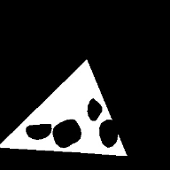

# CLIMBNET - 🧗🏻‍♂️CNN for detecting + segmenting indoor climbing holds


# Overview

Climbnet is a CCN that detects holds on climbing gym walls and returns the appropriate boundary mask for use in instance segmentation.

## Images

There model has been trained with 210 images.  
`Holds` in the image have been tagged with two different categories.

## Categories

`HOLD` - Includes holds as well as the large shaped volumes that a lot of gyms use.

 


`VOLUME` - This refers to any and all box volumes. They are usually made of wood, triangular in shape, and usually have bolt holes so that holds can be mounted on them. Note that sometimes these are used as holds and sometimes not, depends on the gym. They are somtimes considered an extension of the wall and sometimes specific to a single climb. Again, it depends on the gym, setter, etc.

<!--   -->


| Category | Total |
| -------- | :---: |
| Hold     | 7307  |
| Volume   |  520  |

# Model

Available for download

📁 [google drive](https://drive.google.com/open?id=1kbh4VqNh8JJF5hvb_mgERmptTi29_AJe)

# Technical

This project uses Facebook's [detectron2](https://github.com/facebookresearch/detectron2) implmentation of [Mask R-CNN](https://github.com/facebookresearch/detectron2/blob/master/configs/COCO-Detection/faster_rcnn_R_50_FPN_3x.yaml).

# Installing

Follow the detectron2 [getting started guide](https://github.com/facebookresearch/detectron2/blob/master/GETTING_STARTED.md) and replace their `COCO` weights with those downloaded from the google drive

```
python demo.py --config-file ../configs/COCO-InstanceSegmentation/mask_rcnn_R_50_FPN_3x.yaml \
  --input input1.jpg input2.jpg \
  [--other-options]
  --opts MODEL.WEIGHTS detectron2://COCO-InstanceSegmentation/mask_rcnn_R_50_FPN_3x/137849600/model_final_f10217.pkl
```

# Issues

## 📷 Imagery

Most of the imagery used was sourced from the internet. As a result of that, most images already had compression or filters applied to them and are rather small in size, usually `1280x1280` or smaller.

Most of the imagery was taken from the same vantage point, which is usually directly facing the wall. This may lead to issues when running inference on imagery with different vantage points(sport climbs) or extremely sloped walls.

## 🎨 Categories - Should there be more, etc.

I'm not sure if two categories is the correct amount. It might be worth it to create different categories of holds and/or volumes as the number of training images increases.

## 🤿 Segmented Polygons

There are some segmented polygons in the data. They exist because the program that I used for tagging [Hyperlabel](https://hyperlable.com) does not support grouping as per the `COCO` specification. Both `Holds` and `Volumes` are affected.

> Ex. both pieces of the polygon below should be sent through the network as a part of a single segment but are currently passed as two distincly seperate holds


# Swiss Chesse Problem

This is a problem that I encountered while tagging the data that I later found an easier solution to.

If you think of piece of swiss cheese sans holes (image A) how do you easily tag/generate the boundaries of the cheese without including the holes (image B).

A. 
B. 

This problem occurs mainly with `volumes` that have `holds` mounted onto them. When creating the polygonal boundaries the volume needs to be seperate from any attached holds.

The complicated and time consuming way to achieve this is to trace around the image in a pattern similar to how a piece of stained glass. Depending on the size of the volume and the holds that are mounted, you may need to use seperate polygons to tag the polygon correctly (image C).

The easier and less time consumeing way to go about this is to tag each of the holds mounted on the volume and then tag the volume as a single polygon. Prior to training you run a pre-processing step that generates the correct mask (image E) using simple bit-manipulation. This process negates having to group any disparite volume segments.

C.  D.  E. 

# Contributing

Contributions/Suggestions are welcome and encouraged.

## 📷 The Project needs more high quality images.

Submit a pull request with your images added to the `contribution_images` folder or e-mail me: [sebastian@cydivision.com](mailto:sebastian@cydivision.com)
